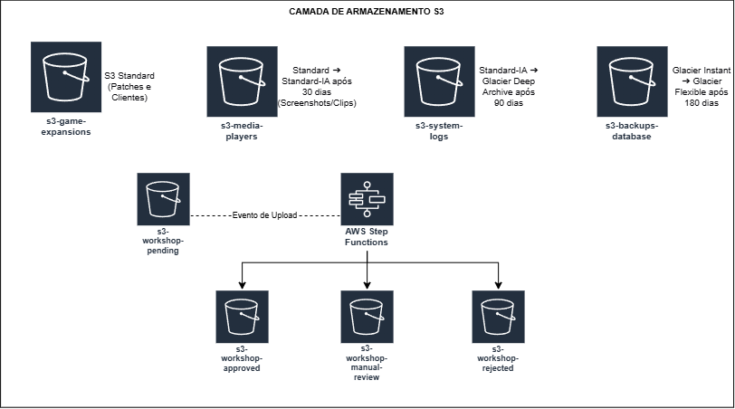
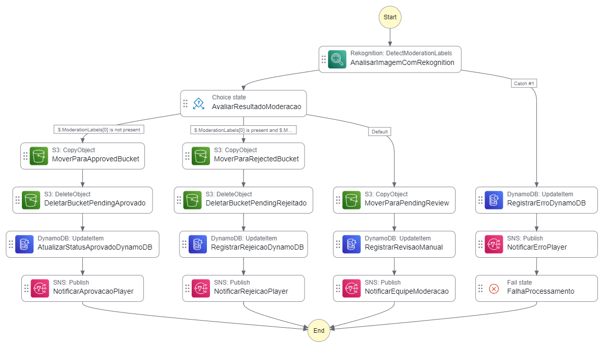

MMORPG Workshop — Moderação Serverless com AWS Step Functions
---


Este repositório contém a documentação, diagramas e código de orquestração do módulo de moderação de ativos da comunidade (*Skins e Texturas*) para a infraestrutura backend de um MMORPG.

O projeto foi desenvolvido como entregável do desafio **"Explorando Workflows Automatizados com AWS Step Functions"** do bootcamp **GFT - Fundamentos de Cloud com AWS** na [Digital Innovation One (DIO)](https://www.google.com/search?q=https://www.dio.me/).

---

## Visão Geral do Projeto

Na arquitetura inicial do jogo, o envio de artes feitas pela comunidade (*Workshop*) passava por um fluxo genérico via *AWS Data Pipeline*. Com a modernização da infraestrutura para um modelo **100% Serverless e Event-Driven**, o processo foi substituído por uma **State Machine no AWS Step Functions**.

A nova solução permite orquestrar chamadas assíncronas entre **Amazon Rekognition** (IA/Visão Computacional), **Amazon S3** (Armazenamento), **Amazon DynamoDB** (Persistência de Estado) e **Amazon SNS** (Notificações ao jogador e à equipe interna), garantindo alta resiliência, rastreabilidade e baixo custo.

---

## Atualização da Camada de Armazenamento S3

Para comportar os diferentes estágios de moderação orquestrados pelo AWS Step Functions, a camada de armazenamento S3 do ecossistema do jogo foi reestruturada. O fluxo substitui a moderação legado por um pipeline orientado a eventos, segregando o ciclo de vida das imagens enviadas pela comunidade:



| Bucket | Função |
| --- | --- |
| `s3-workshop-pending` | Ponto de entrada (*Ingestion*). Recebe o upload direto do jogador. |
| `s3-workshop-approved` | Arquivos aprovados e prontos para distribuição aos clientes do jogo. |
| `s3-workshop-manual-review` | Arquivos com nível médio/baixo de suspeita, aguardando revisão humana. |
| `s3-workshop-rejected` | Arquivos rejeitados por alta confiança de violação das diretrizes. |

---

## Orquestração do Workflow (Step Functions)

O gráfico abaixo ilustra a máquina de estados gerada no **AWS Step Functions Workflow Studio**. O fluxo toma decisões em tempo real com base no retorno da API do Amazon Rekognition e garante o tratamento completo de falhas:



### Fluxos da Máquina de Estados:

1. **Aprovação Automática (`IsPresent: false`):**
* O Rekognition não detecta nenhuma marca de conteúdo impróprio.
* O arquivo é copiado para `s3-workshop-approved` e removido do bucket temporário.
* O status no DynamoDB é atualizado para `APPROVED` e o jogador recebe notificação de sucesso via SNS.


2. **Rejeição Automática (`Confidence >= 90%`):**
* O Rekognition identifica conteúdo impróprio com alta confiança.
* O arquivo é movido para `s3-workshop-rejected` e removido de `pending`.
* O status no DynamoDB vira `REJECTED` com justificativa automática e o jogador é notificado.


3. **Revisão Manual / Human-in-the-Loop (`Default`):**
* O Rekognition detecta possíveis marcas, mas com confiança abaixo de 90%.
* O arquivo é movido para `s3-workshop-manual-review`.
* O DynamoDB registra o status `PENDING_MANUAL_REVIEW` e dispara uma notificação no canal interno da equipe de moderação.


4. **Tratamento de Erros e Resiliência (`Catch` & `Fail`):**
* Falhas de API ou timeout no Rekognition acionam a cláusula `Catch`.
* O estado da skin vira `ERROR` no DynamoDB, o jogador é notificado para refazer o upload e o workflow finaliza em estado de falha (`Fail State`).


---

## Código ASL (Amazon States Language)

O código abaixo define a estrutura do gráfico e pode ser importado diretamente no **AWS Step Functions Workflow Studio**:

```json
{
  "Comment": "Workflow de Moderacao de Skins MMORPG com Moderação Multi-nível e Tratamento de Erros",
  "StartAt": "AnalisarImagemComRekognition",
  "States": {
    "AnalisarImagemComRekognition": {
      "Type": "Task",
      "Resource": "arn:aws:states:::aws-sdk:rekognition:detectModerationLabels",
      "Parameters": {
        "Image": {
          "S3Object": {
            "Bucket.$": "$.detail.bucket.name",
            "Name.$": "$.detail.object.key"
          }
        }
      },
      "Retry": [
        {
          "ErrorEquals": [
            "States.ALL"
          ],
          "IntervalSeconds": 2,
          "MaxAttempts": 3,
          "BackoffRate": 2
        }
      ],
      "Catch": [
        {
          "ErrorEquals": [
            "States.ALL"
          ],
          "Next": "RegistrarErroDynamoDB"
        }
      ],
      "Next": "AvaliarResultadoModeracao"
    },
    "AvaliarResultadoModeracao": {
      "Type": "Choice",
      "Choices": [
        {
          "Variable": "$.ModerationLabels[0]",
          "IsPresent": false,
          "Next": "MoverParaApprovedBucket"
        },
        {
          "And": [
            {
              "Variable": "$.ModerationLabels[0]",
              "IsPresent": true
            },
            {
              "Variable": "$.ModerationLabels[0].Confidence",
              "NumericGreaterThanEquals": 90
            }
          ],
          "Next": "MoverParaRejectedBucket"
        }
      ],
      "Default": "MoverParaPendingReview"
    },
    "MoverParaPendingReview": {
      "Type": "Task",
      "Resource": "arn:aws:states:::aws-sdk:s3:copyObject",
      "Parameters": {
        "Bucket": "s3-workshop-manual-review",
        "CopySource.$": "States.Format('{}/{}', $.detail.bucket.name, $.detail.object.key)",
        "Key.$": "$.detail.object.key"
      },
      "Next": "RegistrarRevisaoManual"
    },
    "MoverParaApprovedBucket": {
      "Type": "Task",
      "Resource": "arn:aws:states:::aws-sdk:s3:copyObject",
      "Parameters": {
        "Bucket": "s3-workshop-approved",
        "CopySource.$": "States.Format('{}/{}', $.detail.bucket.name, $.detail.object.key)",
        "Key.$": "$.detail.object.key"
      },
      "Next": "DeletarBucketPendingAprovado"
    },
    "DeletarBucketPendingAprovado": {
      "Type": "Task",
      "Resource": "arn:aws:states:::aws-sdk:s3:deleteObject",
      "Parameters": {
        "Bucket.$": "$.detail.bucket.name",
        "Key.$": "$.detail.object.key"
      },
      "Next": "AtualizarStatusAprovadoDynamoDB"
    },
    "AtualizarStatusAprovadoDynamoDB": {
      "Type": "Task",
      "Resource": "arn:aws:states:::dynamodb:updateItem",
      "Parameters": {
        "TableName": "MMORPG-Workshop-Items",
        "Key": {
          "SkinId": {
            "S.$": "$.detail.object.key"
          }
        },
        "UpdateExpression": "SET #s = :status",
        "ExpressionAttributeNames": {
          "#s": "status"
        },
        "ExpressionAttributeValues": {
          ":status": {
            "S": "APPROVED"
          }
        }
      },
      "Next": "NotificarAprovacaoPlayer"
    },
    "NotificarAprovacaoPlayer": {
      "Type": "Task",
      "Resource": "arn:aws:states:::sns:publish",
      "Parameters": {
        "TopicArn": "arn:aws:sns:us-east-2:123456789012:WorkshopApprovalTopic",
        "Message": "Sua skin foi aprovada com sucesso e ja esta disponível na loja!"
      },
      "End": true
    },
    "MoverParaRejectedBucket": {
      "Type": "Task",
      "Resource": "arn:aws:states:::aws-sdk:s3:copyObject",
      "Parameters": {
        "Bucket": "s3-workshop-rejected",
        "CopySource.$": "States.Format('{}/{}', $.detail.bucket.name, $.detail.object.key)",
        "Key.$": "$.detail.object.key"
      },
      "Next": "DeletarBucketPendingRejeitado"
    },
    "DeletarBucketPendingRejeitado": {
      "Type": "Task",
      "Resource": "arn:aws:states:::aws-sdk:s3:deleteObject",
      "Parameters": {
        "Bucket.$": "$.detail.bucket.name",
        "Key.$": "$.detail.object.key"
      },
      "Next": "RegistrarRejeicaoDynamoDB"
    },
    "RegistrarRejeicaoDynamoDB": {
      "Type": "Task",
      "Resource": "arn:aws:states:::dynamodb:updateItem",
      "Parameters": {
        "TableName": "MMORPG-Workshop-Items",
        "Key": {
          "SkinId": {
            "S.$": "$.detail.object.key"
          }
        },
        "UpdateExpression": "SET #s = :status, #r = :reason",
        "ExpressionAttributeNames": {
          "#s": "status",
          "#r": "reason"
        },
        "ExpressionAttributeValues": {
          ":status": {
            "S": "REJECTED"
          },
          ":reason": {
            "S": "Alta confianca de conteudo improprio detectado automatizado"
          }
        }
      },
      "Next": "NotificarRejeicaoPlayer"
    },
    "NotificarRejeicaoPlayer": {
      "Type": "Task",
      "Resource": "arn:aws:states:::sns:publish",
      "Parameters": {
        "TopicArn": "arn:aws:sns:us-east-2:123456789012:WorkshopRejectionTopic",
        "Message": "Sua skin foi rejeitada por violacao automatica das diretrizes de conteudo."
      },
      "End": true
    },
    "RegistrarRevisaoManual": {
      "Type": "Task",
      "Resource": "arn:aws:states:::dynamodb:updateItem",
      "Parameters": {
        "TableName": "MMORPG-Workshop-Items",
        "Key": {
          "SkinId": {
            "S.$": "$.detail.object.key"
          }
        },
        "UpdateExpression": "SET #s = :status, #r = :reason",
        "ExpressionAttributeNames": {
          "#s": "status",
          "#r": "reason"
        },
        "ExpressionAttributeValues": {
          ":status": {
            "S": "PENDING_MANUAL_REVIEW"
          },
          ":reason": {
            "S": "Confianca media/baixa de moderacao. Aguardando revisao humana."
          }
        }
      },
      "Next": "NotificarEquipeModeracao"
    },
    "NotificarEquipeModeracao": {
      "Type": "Task",
      "Resource": "arn:aws:states:::sns:publish",
      "Parameters": {
        "TopicArn": "arn:aws:sns:us-east-2:123456789012:WorkshopManualReviewTopic",
        "Message": "Uma nova skin requer revisao manual da equipe de moderacao."
      },
      "End": true
    },
    "RegistrarErroDynamoDB": {
      "Type": "Task",
      "Resource": "arn:aws:states:::dynamodb:updateItem",
      "Parameters": {
        "TableName": "MMORPG-Workshop-Items",
        "Key": {
          "SkinId": {
            "S.$": "$.detail.object.key"
          }
        },
        "UpdateExpression": "SET #s = :status, #r = :reason",
        "ExpressionAttributeNames": {
          "#s": "status",
          "#r": "reason"
        },
        "ExpressionAttributeValues": {
          ":status": {
            "S": "ERROR"
          },
          ":reason": {
            "S": "Falha interna no processamento da imagem"
          }
        }
      },
      "Next": "NotificarErroPlayer"
    },
    "NotificarErroPlayer": {
      "Type": "Task",
      "Resource": "arn:aws:states:::sns:publish",
      "Parameters": {
        "TopicArn": "arn:aws:sns:us-east-2:123456789012:WorkshopErrorTopic",
        "Message": "Houve um erro ao processar sua skin. Por favor, tente enviar o arquivo novamente."
      },
      "Next": "FalhaProcessamento"
    },
    "FalhaProcessamento": {
      "Type": "Fail",
      "Error": "ProcessingError",
      "Cause": "Ocorreu um erro no processamento do fluxo de moderação."
    }
  }
}

```

---

## Insights e Aprendizados

**1. Integrações Diretas via SDK (Optimized Integrations):** O Step Functions permite chamar APIs como `s3:copyObject`, `dynamodb:updateItem` ou `rekognition:detectModerationLabels` diretamente, reduzindo a necessidade de escrever e manter funções AWS Lambda intermediárias.

**2. Abordagem Human-in-the-Loop:** Algoritmos de Machine Learning não devem tomar decisões extremas quando a margem de incerteza é considerável. A implementação de thresholds de confiança (`Confidence >= 90`) balanceia automação e precisão.

**3. Auditoria e Governança:** O isolamento de arquivos em buckets específicos (`s3-workshop-rejected` e `s3-workshop-manual-review`) garante retenção adequada de dados para análise de conformidade e prevenção de fraudes.

**4. Observabilidade e Resiliência:** Estruturar um fluxo explícito de exceção usando os blocos `Catch` e `Fail State` garante que nenhuma falha no pipeline passe despercebida pelo sistema ou pelo usuário final.

---

## Como Replicar este Projeto

1. Acesse o **AWS Console** e abra o serviço **AWS Step Functions**.
2. Clique em **Create State Machine**.
3. Selecione a opção **Blank** e altere para o modo de edição **Code** (ou abra o **Workflow Studio**).
4. Cole o conteúdo do arquivo `workflow-moderacao-skins.asl.json` no editor.
5. O diagrama visual será gerado automaticamente.

---

## Recursos Utilizados
* [AWS Architecture Icons](https://aws.amazon.com/pt/architecture/icons/)
* [AWS Step Functions](https://aws.amazon.com/pt/step-functions/)

---

>  **Nota de Transparência:**
> A estrutura e a formatação deste `README.md` foram aprimoradas com o auxílio do **Google Gemini** como um recurso estético e de organização. O objetivo foi transformar a documentação técnica da arquitetura desenvolvida em um formato mais atrativo, legível e profissional para o portfólio. O trabalho em si foi feito por mim utilizando o conhecimento adquirido pelo curso e estudos próprios.
